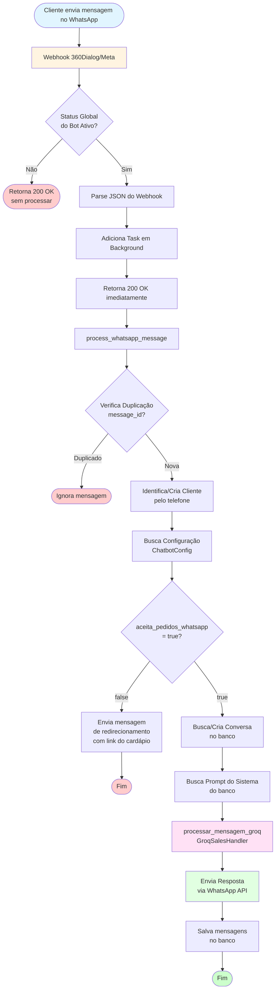
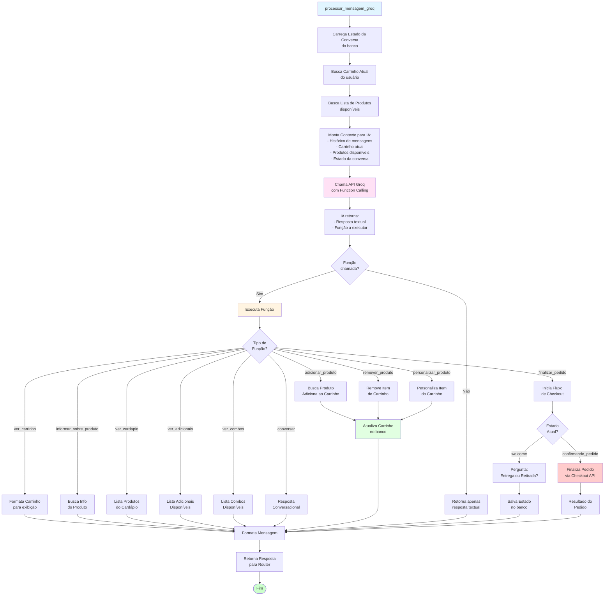
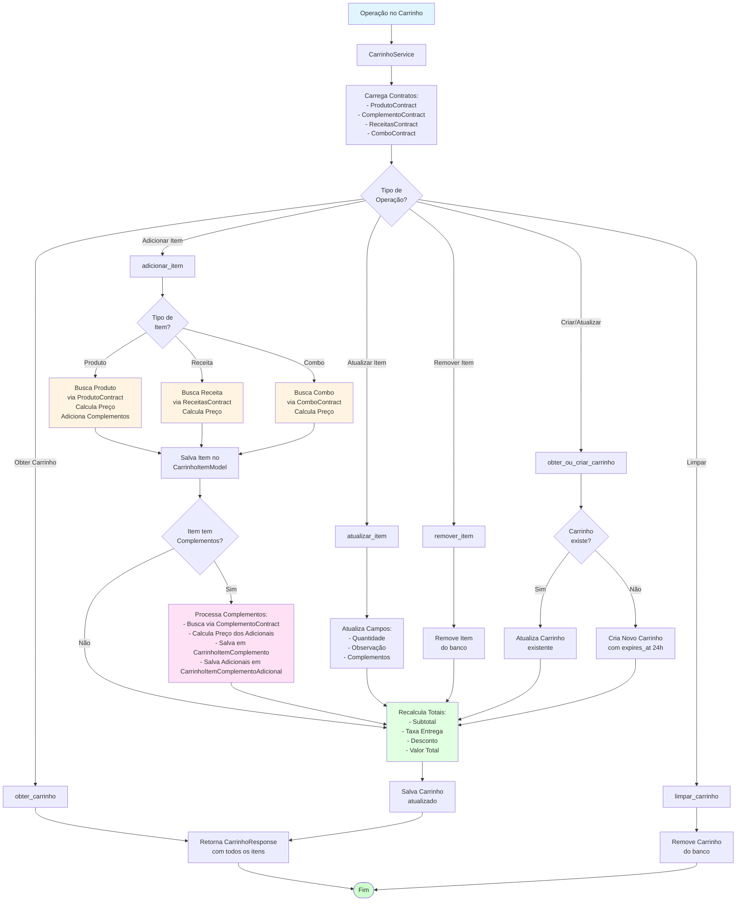
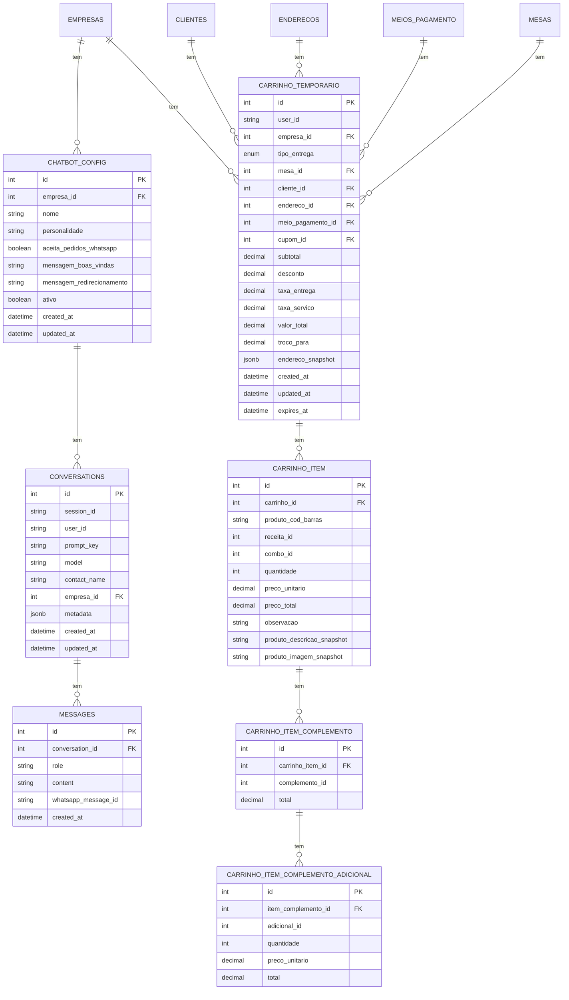
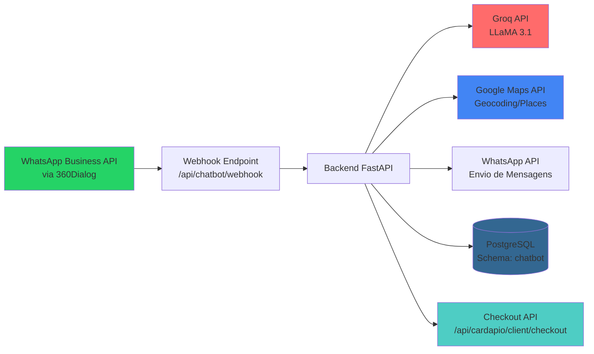
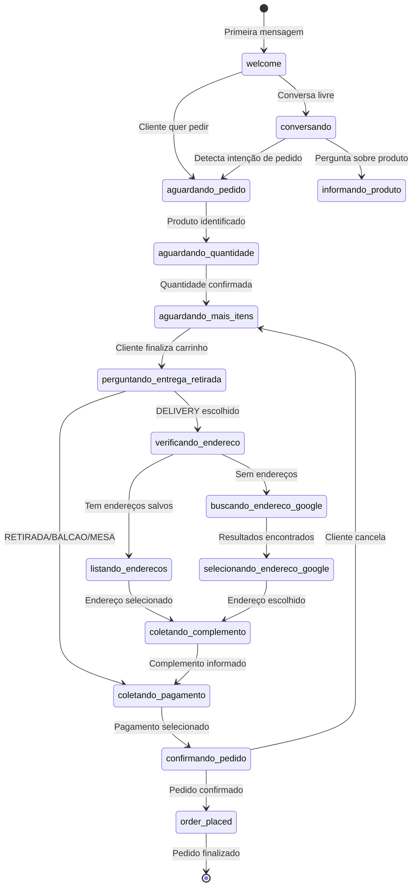

# 📊 Diagrama Completo do Fluxo do Chatbot

## 🎯 Visão Geral do Sistema

Este documento apresenta o diagrama completo de como funciona o sistema de chatbot integrado com WhatsApp, IA (Groq/LLaMA), carrinho temporário e finalização de pedidos.

---

## 🔄 Fluxo Principal - Processamento de Mensagens

---

## 🤖 Fluxo do GroqSalesHandler - Processamento com IA

---

## 🛒 Fluxo do Carrinho Temporário

---

## 💳 Fluxo de Checkout e Finalização de Pedido

```mermaid
graph TB
    Start[Cliente solicita<br/>finalizar pedido] --> CheckCart{Carrinho<br/>tem itens?}
    CheckCart -->|Não| EmptyCart[Resposta:<br/>Carrinho vazio]
    CheckCart -->|Sim| CheckState{Estado<br/>da Conversa?}
    
    CheckState -->|welcome| AskDeliveryType[Pergunta:<br/>DELIVERY, RETIRADA,<br/>BALCAO ou MESA?]
    AskDeliveryType --> SaveState1[Salva estado:<br/>perguntando_entrega_retirada]
    
    CheckState -->|perguntando_entrega_retirada| ProcessDelivery[Processa Resposta:<br/>Salva tipo_entrega]
    ProcessDelivery --> CheckType{Tipo de<br/>Entrega?}
    
    CheckType -->|DELIVERY| AddressFlow[Fluxo de Endereço]
    CheckType -->|RETIRADA| PaymentFlow[Fluxo de Pagamento]
    CheckType -->|BALCAO| PaymentFlow
    CheckType -->|MESA| AskTable[Pergunta Número<br/>da Mesa]
    
    AskTable --> SaveTable[Salva mesa_id]
    SaveTable --> PaymentFlow
    
    AddressFlow --> CheckAddress{Cliente tem<br/>endereços salvos?}
    CheckAddress -->|Sim| ListAddresses[Lista Endereços<br/>Salvos]
    CheckAddress -->|Não| SearchGoogle[Busca no Google Maps<br/>via API]
    
    ListAddresses --> SelectAddress[Cliente seleciona<br/>ou informa novo]
    SearchGoogle --> ShowResults[Mostra Resultados<br/>do Google]
    ShowResults --> SelectGoogle[Cliente seleciona<br/>endereço]
    
    SelectAddress --> AskComplement[Pergunta Complemento<br/>do Endereço]
    SelectGoogle --> AskComplement
    AskComplement --> SaveAddress[Salva endereco_id<br/>ou endereco_snapshot]
    SaveAddress --> PaymentFlow
    
    PaymentFlow --> ListPayments[Lista Meios de<br/>Pagamento Disponíveis]
    ListPayments --> SelectPayment[Cliente seleciona<br/>meio de pagamento]
    SelectPayment --> AskTroco{Tipo de<br/>Pagamento?}
    
    AskTroco -->|Dinheiro| AskTrocoValue[Pergunta Troco Para]
    AskTroco -->|Outros| ConfirmOrder
    
    AskTrocoValue --> SaveTroco[Salva troco_para]
    SaveTroco --> ConfirmOrder[Mostra Resumo<br/>do Pedido]
    
    ConfirmOrder --> WaitConfirm[Aguarda Confirmação<br/>do Cliente]
    WaitConfirm --> CheckConfirm{Cliente<br/>confirmou?}
    
    CheckConfirm -->|Não| CancelOrder[Cancelado]
    CheckConfirm -->|Sim| ConvertCart[Converte Carrinho<br/>para FinalizarPedidoRequest]
    
    ConvertCart --> CallCheckout[Chama API Checkout:<br/>POST /api/cardapio/client/checkout/finalizar]
    CallCheckout --> CheckResult{Resultado<br/>do Checkout?}
    
    CheckResult -->|Sucesso| SaveOrder[Pedido criado<br/>com sucesso]
    CheckResult -->|Erro| ShowError[Mostra Erro<br/>ao Cliente]
    
    SaveOrder --> ClearCart[Limpa Carrinho<br/>Temporário]
    ClearCart --> SendConfirmation[Envia Confirmação<br/>com Número do Pedido]
    SendConfirmation --> End([Fim])
    
    ShowError --> End
    CancelOrder --> End
    EmptyCart --> End
    
    style Start fill:#e1f5ff
    style AddressFlow fill:#fff4e1
    style PaymentFlow fill:#ffe1f5
    style CallCheckout fill:#ffcccc
    style SaveOrder fill:#ccffcc
    style End fill:#ccffcc
```

---

## 🗄️ Estrutura de Dados e Banco de Dados

---

## 🔧 Componentes Principais

### 1. **Router (`router.py`)**
- Recebe webhooks do WhatsApp (360Dialog/Meta)
- Processa mensagens em background
- Gerencia conversas e histórico
- Endpoints administrativos

### 2. **GroqSalesHandler (`groq_sales_handler.py`)**
- Integração com API Groq (LLaMA 3.1)
- Function Calling para ações do chatbot
- Gerenciamento de estados da conversa
- Processamento de intenções do usuário

### 3. **CarrinhoService (`service_carrinho.py`)**
- Gerencia carrinho temporário
- Adiciona/remove/atualiza itens
- Calcula totais e complementos
- Converte para formato de checkout

### 4. **ChatbotConfigService (`service_chatbot_config.py`)**
- CRUD de configurações do chatbot
- Validação de regras de negócio
- Gerenciamento por empresa

### 5. **AddressService (`address_service.py`)**
- Integração com Google Maps API
- Gerenciamento de endereços salvos
- Validação de endereços

### 6. **IngredientesService (`ingredientes_service.py`)**
- Detecção de remoção de ingredientes
- Detecção de adicionais extras
- Personalização de produtos

---

## 📡 APIs e Integrações Externas

---

## 🔄 Estados da Conversa

---

## 🎯 Function Calling - Funções Disponíveis para a IA

| Função | Descrição | Quando Usar |
|--------|-----------|-------------|
| `adicionar_produto` | Adiciona produto ao carrinho | Cliente pede produto específico |
| `finalizar_pedido` | Inicia fluxo de checkout | Cliente quer fechar pedido |
| `ver_cardapio` | Lista produtos disponíveis | Cliente pede ver cardápio |
| `ver_carrinho` | Mostra itens do carrinho | Cliente quer ver pedido atual |
| `remover_produto` | Remove item do carrinho | Cliente quer cancelar item |
| `informar_sobre_produto` | Informa sobre produto | Cliente pergunta sobre produto |
| `personalizar_produto` | Personaliza produto no carrinho | Cliente quer modificar item |
| `ver_adicionais` | Lista adicionais disponíveis | Cliente pergunta sobre extras |
| `ver_combos` | Lista combos disponíveis | Cliente pergunta sobre combos |
| `conversar` | Resposta conversacional | Qualquer outra situação |

---

## 📝 Notas Importantes

1. **Webhook deve retornar 200 OK imediatamente** (requisito da 360Dialog)
2. **Processamento em background** para não violar limite de 5 segundos
3. **Carrinho temporário expira em 24 horas** (campo `expires_at`)
4. **Duplicação de mensagens** é evitada usando `whatsapp_message_id`
5. **Configuração por empresa** permite diferentes comportamentos
6. **Function Calling** permite que a IA execute ações no sistema
7. **Estados da conversa** são salvos no campo `metadata` da tabela `conversations`

---

## 🔐 Segurança e Validações

- ✅ Validação de token JWT em endpoints administrativos
- ✅ Verificação de status global do bot antes de processar
- ✅ Validação de empresa_id em todas as operações
- ✅ Verificação de duplicação de mensagens
- ✅ Validação de dados antes de criar/atualizar carrinho
- ✅ Verificação de produtos disponíveis antes de adicionar
- ✅ Cálculo seguro de valores monetários (Decimal)

---

## 📊 Métricas e Monitoramento

- Logs de todas as operações importantes
- Histórico completo de conversas no banco
- Rastreamento de mensagens via `whatsapp_message_id`
- Timestamps em todas as tabelas para auditoria
- Campo `expires_at` para limpeza automática de carrinhos abandonados

---

**Última atualização:** 2024
**Versão do Sistema:** 2.0
