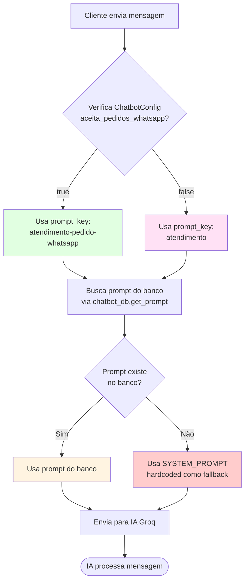

# 📝 Prompts que Devem Estar Cadastrados no Banco de Dados

## 🎯 Visão Geral

O sistema de chatbot utiliza a tabela `chatbot.prompts` para armazenar os **System Prompts** (instruções para a IA). Estes prompts definem o comportamento e personalidade do chatbot em diferentes contextos.

---

## ✅ Prompts Obrigatórios (Padrão)

Estes prompts são criados automaticamente pela função `seed_default_prompts()` e **DEVEM** estar cadastrados no banco:

### 1. **`default`** - Prompt Padrão (Alex - Suporte)
- **Key:** `"default"`
- **Nome:** `"Padrão (Alex - Suporte)"`
- **Uso:** Prompt genérico de suporte ao cliente
- **Características:**
  - Atendente humano chamado Alex
  - Amigável, paciente e prestativo
  - Linguagem natural e casual
  - Reage a notificações de pedidos
  - Gerencia diferentes tipos de pedidos (Delivery, Mesa, Balcão)

### 2. **`atendimento`** - Atendimento (Suporte)
- **Key:** `"atendimento"`
- **Nome:** `"Atendimento (Suporte)"`
- **Uso:** Quando `aceita_pedidos_whatsapp = false` na configuração do chatbot
- **Características:**
  - Atendente de suporte ao cliente
  - **NÃO aceita pedidos pelo WhatsApp**
  - Direciona para link do cardápio quando cliente quer pedir
  - Linguagem natural e conversacional

### 3. **`atendimento-pedido-whatsapp`** - Atendimento (Pedido via WhatsApp)
- **Key:** `"atendimento-pedido-whatsapp"`
- **Nome:** `"Atendimento (Pedido via WhatsApp)"`
- **Uso:** Quando `aceita_pedidos_whatsapp = true` na configuração do chatbot
- **Características:**
  - Especializado em pedidos via WhatsApp
  - Ajuda cliente a montar pedido
  - Confirma itens e quantidades
  - Coleta dados de entrega/retirada
  - **Este é o prompt padrão usado pelo GroqSalesHandler**

---

## 🔄 Como os Prompts São Usados

### Fluxo de Seleção do Prompt



### Código de Referência

No `router.py` (linhas 1499-1500):
```python
prompt_key_sales = PROMPT_ATENDIMENTO_PEDIDO_WHATSAPP  # "atendimento-pedido-whatsapp"
prompt_key_support = PROMPT_ATENDIMENTO  # "atendimento"
```

No `groq_sales_handler.py` (linha 42):
```python
DEFAULT_PROMPT_KEY = "atendimento-pedido-whatsapp"
```

---

## 📋 Estrutura da Tabela `chatbot.prompts`

```sql
CREATE TABLE chatbot.prompts (
    id SERIAL PRIMARY KEY,
    key VARCHAR(100) UNIQUE NOT NULL,        -- Chave única do prompt
    name VARCHAR(255) NOT NULL,              -- Nome descritivo
    content TEXT NOT NULL,                    -- Conteúdo do prompt (System Prompt)
    is_default BOOLEAN DEFAULT FALSE,         -- Se é prompt padrão do sistema
    empresa_id INTEGER,                       -- NULL = global, ou ID da empresa
    created_at TIMESTAMP DEFAULT CURRENT_TIMESTAMP,
    updated_at TIMESTAMP DEFAULT CURRENT_TIMESTAMP
);
```

---

## 🔧 Como Criar/Atualizar Prompts

### 1. Via Código (Seed Automático)

Os prompts padrão são criados automaticamente quando:
- O banco é inicializado (`init_db.py`)
- A aplicação inicia (`main.py`)

Função: `seed_default_prompts(db: Session)`

### 2. Via API REST

#### Listar todos os prompts:
```http
GET /api/chatbot/prompts
GET /api/chatbot/prompts?empresa_id=1
```

#### Buscar prompt específico:
```http
GET /api/chatbot/prompts/{key}
GET /api/chatbot/prompts/atendimento-pedido-whatsapp
```

#### Criar novo prompt:
```http
POST /api/chatbot/prompts
Content-Type: application/json

{
  "key": "meu-prompt-customizado",
  "name": "Meu Prompt Personalizado",
  "content": "Você é um atendente...",
  "is_default": false,
  "empresa_id": 1
}
```

#### Atualizar prompt:
```http
PUT /api/chatbot/prompts/{key}
Content-Type: application/json

{
  "name": "Nome Atualizado",
  "content": "Novo conteúdo do prompt..."
}
```

#### Deletar prompt (apenas customizados):
```http
DELETE /api/chatbot/prompts/{key}
```

**⚠️ IMPORTANTE:** Prompts com `is_default = true` **NÃO podem ser deletados** via API.

---

## 🎨 Prompts Customizados por Empresa

Você pode criar prompts específicos para cada empresa:

```python
# Exemplo: Prompt customizado para empresa_id = 1
chatbot_db.create_prompt(
    db=db,
    key="atendimento-pedido-whatsapp",  # Mesma key do padrão
    name="Atendimento Personalizado - Empresa 1",
    content="Você é um atendente especializado...",
    is_default=False,
    empresa_id=1  # Específico para empresa 1
)
```

**Prioridade de Busca:**
1. Primeiro busca prompt com `empresa_id` específico
2. Se não encontrar, busca prompt global (`empresa_id IS NULL`)
3. Se não encontrar, usa fallback hardcoded

---

## ✅ Checklist de Verificação

Para garantir que o sistema funcione corretamente, verifique:

- [ ] Prompt `"default"` existe no banco
- [ ] Prompt `"atendimento"` existe no banco
- [ ] Prompt `"atendimento-pedido-whatsapp"` existe no banco
- [ ] Todos os prompts têm `is_default = true`
- [ ] O conteúdo dos prompts está atualizado
- [ ] Não há prompts duplicados com mesma `key` e `empresa_id`

### Query SQL para Verificar:

```sql
-- Lista todos os prompts cadastrados
SELECT 
    key,
    name,
    is_default,
    empresa_id,
    LENGTH(content) as tamanho_conteudo,
    created_at,
    updated_at
FROM chatbot.prompts
ORDER BY is_default DESC, key, empresa_id NULLS LAST;

-- Verifica se os 3 prompts obrigatórios existem
SELECT 
    key,
    CASE 
        WHEN COUNT(*) > 0 THEN '✅ Existe'
        ELSE '❌ Faltando'
    END as status
FROM (
    SELECT 'default' as key
    UNION ALL SELECT 'atendimento'
    UNION ALL SELECT 'atendimento-pedido-whatsapp'
) required
LEFT JOIN chatbot.prompts p ON p.key = required.key AND p.is_default = true
GROUP BY required.key
ORDER BY required.key;
```

---

## 🔄 Relação com ChatbotConfig

| Campo | Descrição | Relação com Prompts |
|-------|-----------|---------------------|
| `personalidade` | Texto livre sobre personalidade | Pode ser usado para complementar o prompt |
| `aceita_pedidos_whatsapp` | Se aceita pedidos | **Define qual prompt usar** (`atendimento-pedido-whatsapp` ou `atendimento`) |
| `nome` | Nome do chatbot | Não afeta o prompt diretamente |
| `mensagem_boas_vindas` | Mensagem inicial | Não é um prompt, é mensagem fixa |

---

## 📝 Notas Importantes

1. **Prompts são System Prompts**: Eles definem o comportamento da IA, não são mensagens para o usuário
2. **Prompts padrão são protegidos**: Não podem ser deletados via API (apenas customizados)
3. **Prioridade por empresa**: Prompts específicos de empresa têm prioridade sobre globais
4. **Fallback sempre existe**: Se o prompt não for encontrado, usa `SYSTEM_PROMPT` hardcoded
5. **Conversas armazenam prompt_key**: Cada conversa salva qual prompt foi usado no campo `prompt_key`

---

## 🚀 Como Recriar os Prompts Padrão

Se os prompts foram deletados acidentalmente ou precisam ser recriados:

### Via Python:
```python
from app.api.chatbot.core.database import seed_default_prompts
from app.database.db_connection import SessionLocal

db = SessionLocal()
try:
    seed_default_prompts(db)
    print("✅ Prompts padrão recriados com sucesso!")
finally:
    db.close()
```

### Via SQL (não recomendado, apenas para emergência):
```sql
-- Ver conteúdo completo em database.py função seed_default_prompts()
```

---

**Última atualização:** 2024
**Versão:** 1.0
