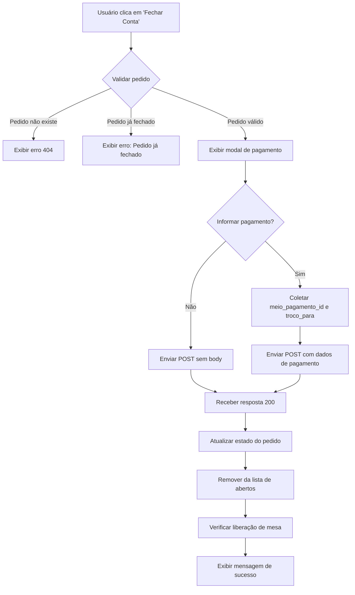
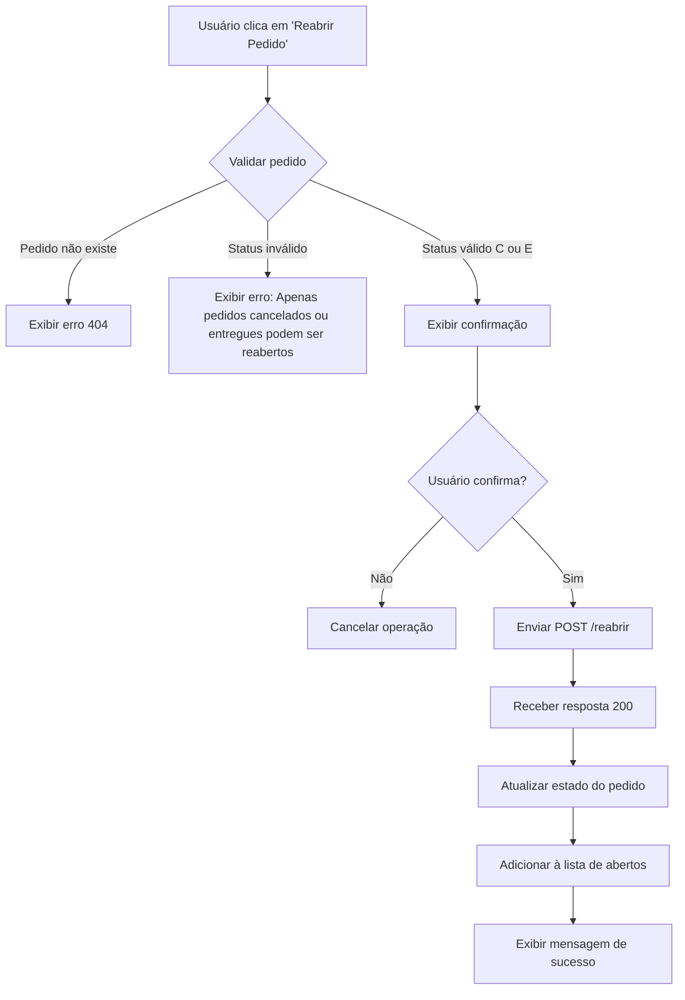

# Documentação API - Fechamento e Reabertura de Pedidos de Balcão

## Visão Geral

Esta documentação descreve as funcionalidades de **fechamento de conta** e **reabertura de pedidos** de balcão para implementação no frontend. Essas operações permitem gerenciar o ciclo de vida completo dos pedidos de balcão.

---

## Índice

1. [Fechamento de Conta](#fechamento-de-conta)
2. [Reabertura de Pedido](#reabertura-de-pedido)
3. [Status de Pedidos](#status-de-pedidos)
4. [Fluxos Recomendados](#fluxos-recomendados)
5. [Exemplos de Implementação](#exemplos-de-implementação)

---

## Fechamento de Conta

### Endpoint: Fechar Conta do Pedido

**POST** `/api/balcao/admin/pedidos/{pedido_id}/fechar-conta`

Fecha a conta de um pedido de balcão, alterando seu status para `ENTREGUE` (`E`).

#### Autenticação
- **Requerida**: Sim
- **Tipo**: Bearer Token (JWT)
- **Permissão**: Admin

#### Parâmetros de URL

| Parâmetro | Tipo | Obrigatório | Descrição |
|-----------|------|-------------|-----------|
| `pedido_id` | `integer` | Sim | ID do pedido a ser fechado (deve ser > 0) |

#### Body (Request) - Opcional

O body é **opcional**. Se não enviar nada, o pedido será fechado sem informações de pagamento.

```json
{
  "meio_pagamento_id": 1,      // Opcional: ID do meio de pagamento utilizado
  "troco_para": 50.00          // Opcional: Valor para o qual deseja troco (apenas para pagamento em dinheiro)
}
```

**Schema TypeScript:**
```typescript
interface FecharContaBalcaoRequest {
  meio_pagamento_id?: number;  // ID do meio de pagamento
  troco_para?: number;         // Valor para troco (ex: 50.00)
}
```

#### Resposta de Sucesso (200 OK)

Retorna o pedido atualizado com status `ENTREGUE`:

```json
{
  "id": 123,
  "empresa_id": 1,
  "numero_pedido": "BAL-000001",
  "mesa_id": 5,
  "cliente_id": 10,
  "status": "E",
  "status_descricao": "Entregue",
  "observacoes": "Pedido para viagem",
  "valor_total": 45.50,
  "meio_pagamento_id": 1,
  "troco_para": 50.00,
  "itens": [
    {
      "id": 1,
      "produto_cod_barras": "7891234567890",
      "quantidade": 2,
      "preco_unitario": 15.00,
      "observacao": "Bem passado",
      "produto_descricao_snapshot": "Hambúrguer Artesanal",
      "produto_imagem_snapshot": "https://..."
    }
  ],
  "created_at": "2024-01-15T10:30:00Z",
  "updated_at": "2024-01-15T11:45:00Z",
  "produtos": {
    "itens": [],
    "receitas": [],
    "combos": []
  }
}
```

**Schema TypeScript da Resposta:**
```typescript
interface PedidoBalcaoOut {
  id: number;
  empresa_id: number;
  numero_pedido: string;
  mesa_id?: number;
  cliente_id?: number;
  status: "P" | "I" | "R" | "E" | "C" | "D" | "X" | "A";
  status_descricao: string;
  observacoes?: string;
  valor_total: number;
  meio_pagamento_id?: number;
  troco_para?: number;
  itens: PedidoBalcaoItemOut[];
  created_at?: string;
  updated_at?: string;
  produtos: ProdutosPedidoOut;
}

interface PedidoBalcaoItemOut {
  id: number;
  produto_cod_barras: string;
  quantidade: number;
  preco_unitario: number;
  observacao?: string;
  produto_descricao_snapshot?: string;
  produto_imagem_snapshot?: string;
}
```

#### Respostas de Erro

| Código | Descrição |
|--------|-----------|
| `400` | Pedido já está fechado ou cancelado |
| `404` | Pedido não encontrado |
| `401` | Não autenticado |
| `403` | Sem permissão (não é admin) |

#### Comportamento do Sistema

Ao fechar um pedido:

1. **Status alterado**: O status do pedido muda para `ENTREGUE` (`E`)
2. **Informações de pagamento**: Se fornecidas, são salvas nos campos:
   - `meio_pagamento_id`: ID do meio de pagamento
   - `troco_para`: Valor para troco
3. **Histórico**: Um registro é adicionado ao histórico do pedido com:
   - Tipo de operação: `PEDIDO_FECHADO`
   - Status anterior e novo status
   - Observações sobre pagamento (se houver)
4. **Liberação de mesa**: Se o pedido estava associado a uma mesa:
   - O sistema verifica se há outros pedidos abertos (de balcão ou mesa) na mesma mesa
   - A mesa só é liberada se não houver mais nenhum pedido aberto
   - O status da mesa muda de `OCUPADA` para `LIVRE` (se aplicável)

---

## Reabertura de Pedido

### Endpoint: Reabrir Pedido

**POST** `/api/balcao/admin/pedidos/{pedido_id}/reabrir`

Reabre um pedido que foi cancelado ou entregue, alterando seu status para `IMPRESSAO` (`I`).

#### Autenticação
- **Requerida**: Sim
- **Tipo**: Bearer Token (JWT)
- **Permissão**: Admin

#### Parâmetros de URL

| Parâmetro | Tipo | Obrigatório | Descrição |
|-----------|------|-------------|-----------|
| `pedido_id` | `integer` | Sim | ID do pedido a ser reaberto (deve ser > 0) |

#### Body (Request)

**Não requer body**. O endpoint não aceita parâmetros no body.

#### Resposta de Sucesso (200 OK)

Retorna o pedido atualizado com status `IMPRESSAO`:

```json
{
  "id": 123,
  "empresa_id": 1,
  "numero_pedido": "BAL-000001",
  "mesa_id": 5,
  "cliente_id": 10,
  "status": "I",
  "status_descricao": "Em impressão",
  "observacoes": "Pedido para viagem",
  "valor_total": 45.50,
  "itens": [...],
  "created_at": "2024-01-15T10:30:00Z",
  "updated_at": "2024-01-15T12:00:00Z",
  "produtos": {...}
}
```

#### Respostas de Erro

| Código | Descrição |
|--------|-----------|
| `404` | Pedido não encontrado |
| `401` | Não autenticado |
| `403` | Sem permissão (não é admin) |

#### Validações

- **Apenas pedidos com status `CANCELADO` (`C`) ou `ENTREGUE` (`E`) podem ser reabertos**
- Se o pedido já estiver em outro status (ex: `PENDENTE`, `PREPARANDO`), a operação não altera o status (retorna o pedido como está)
- O status após reabertura será sempre `IMPRESSAO` (`I`)

#### Comportamento do Sistema

Ao reabrir um pedido:

1. **Status alterado**: O status do pedido muda para `IMPRESSAO` (`I`)
2. **Histórico**: Um registro é adicionado ao histórico do pedido com:
   - Tipo de operação: `PEDIDO_REABERTO`
   - Status anterior e novo status
   - Descrição: "Pedido {numero_pedido} reaberto"
3. **Mesa associada**: Se o pedido tinha uma mesa associada:
   - A mesa pode voltar a ficar ocupada (dependendo do status atual)
   - O sistema não altera automaticamente o status da mesa

### Endpoint Alternativo: Abrir Pedido

**POST** `/api/balcao/admin/pedidos/{pedido_id}/abrir`

Este endpoint é um **atalho** que chama o mesmo método do endpoint `/reabrir`. Aceita os mesmos parâmetros e retorna a mesma resposta.

**Recomendação**: Use o endpoint `/reabrir` para maior clareza no código.

---

## Status de Pedidos

### Status Possíveis

| Código | Descrição | Pode Fechar? | Pode Reabrir? | Cor Sugerida |
|--------|-----------|--------------|---------------|--------------|
| `P` | Pendente | ✅ Sim | ❌ Não | Laranja |
| `I` | Em impressão | ✅ Sim | ❌ Não | Azul |
| `R` | Preparando | ✅ Sim | ❌ Não | Amarelo |
| `E` | Entregue | ❌ Não | ✅ Sim | Verde |
| `C` | Cancelado | ❌ Não | ✅ Sim | Vermelho |
| `D` | Editado | ✅ Sim | ❌ Não | Roxo |
| `X` | Em edição | ✅ Sim | ❌ Não | Teal |
| `A` | Aguardando pagamento | ✅ Sim | ❌ Não | Ciano |

### Transições de Status

#### Fechamento de Conta
```
[P, I, R, D, X, A] → [E] (ENTREGUE)
```

#### Reabertura
```
[C, E] → [I] (IMPRESSAO)
```

---

## Fluxos Recomendados

### Fluxo 1: Fechamento de Conta



**Passos no Frontend:**

1. **Validações prévias:**
   - Verificar se o pedido existe
   - Verificar se o pedido não está já fechado (`status !== "E"`)
   - Verificar se o pedido não está cancelado (`status !== "C"`)

2. **Modal de fechamento:**
   - Exibir valor total do pedido
   - Opção de selecionar meio de pagamento (opcional)
   - Campo para informar troco (opcional, apenas para dinheiro)
   - Botão "Fechar Pedido"
   - Botão "Cancelar"

3. **Chamada à API:**
   ```typescript
   POST /api/balcao/admin/pedidos/{pedido_id}/fechar-conta
   Body: { meio_pagamento_id?, troco_para? } ou null
   ```

4. **Tratamento da resposta:**
   - Se sucesso: atualizar estado do pedido na interface
   - Remover pedido da lista de pedidos abertos
   - Exibir mensagem de sucesso
   - Se houver mesa associada, verificar se foi liberada

5. **Tratamento de erros:**
   - 404: "Pedido não encontrado"
   - 400: "Pedido já está fechado ou cancelado"
   - 401: "Sessão expirada, faça login novamente"
   - 403: "Sem permissão para fechar pedidos"

### Fluxo 2: Reabertura de Pedido



**Passos no Frontend:**

1. **Validações prévias:**
   - Verificar se o pedido existe
   - Verificar se o pedido está cancelado (`status === "C"`) ou entregue (`status === "E"`)
   - Exibir confirmação: "Deseja reabrir este pedido?"

2. **Chamada à API:**
   ```typescript
   POST /api/balcao/admin/pedidos/{pedido_id}/reabrir
   Body: (não requer body)
   ```

3. **Tratamento da resposta:**
   - Se sucesso: atualizar estado do pedido na interface
   - Adicionar pedido à lista de pedidos abertos
   - Exibir mensagem de sucesso
   - Atualizar status para `IMPRESSAO` (`I`)

4. **Tratamento de erros:**
   - 404: "Pedido não encontrado"
   - 401: "Sessão expirada, faça login novamente"
   - 403: "Sem permissão para reabrir pedidos"

---

## Exemplos de Implementação

### Exemplo 1: Fechar Pedido Sem Informações de Pagamento

```typescript
const fecharPedido = async (pedidoId: number) => {
  try {
    const response = await fetch(
      `/api/balcao/admin/pedidos/${pedidoId}/fechar-conta`,
      {
        method: 'POST',
        headers: {
          'Content-Type': 'application/json',
          'Authorization': `Bearer ${token}`
        },
        body: JSON.stringify(null) // ou não enviar body
      }
    );
    
    if (!response.ok) {
      if (response.status === 404) {
        throw new Error('Pedido não encontrado');
      }
      if (response.status === 400) {
        throw new Error('Pedido já está fechado ou cancelado');
      }
      throw new Error('Erro ao fechar pedido');
    }
    
    const pedido = await response.json();
    return pedido;
  } catch (error) {
    console.error('Erro ao fechar pedido:', error);
    throw error;
  }
};
```

### Exemplo 2: Fechar Pedido Com Meio de Pagamento

```typescript
const fecharPedidoComPagamento = async (
  pedidoId: number,
  meioPagamentoId: number
) => {
  try {
    const response = await fetch(
      `/api/balcao/admin/pedidos/${pedidoId}/fechar-conta`,
      {
        method: 'POST',
        headers: {
          'Content-Type': 'application/json',
          'Authorization': `Bearer ${token}`
        },
        body: JSON.stringify({
          meio_pagamento_id: meioPagamentoId
        })
      }
    );
    
    if (!response.ok) {
      throw new Error('Erro ao fechar pedido');
    }
    
    return await response.json();
  } catch (error) {
    console.error('Erro ao fechar pedido:', error);
    throw error;
  }
};
```

### Exemplo 3: Fechar Pedido Com Troco

```typescript
const fecharPedidoComTroco = async (
  pedidoId: number,
  meioPagamentoId: number,
  trocoPara: number
) => {
  try {
    const response = await fetch(
      `/api/balcao/admin/pedidos/${pedidoId}/fechar-conta`,
      {
        method: 'POST',
        headers: {
          'Content-Type': 'application/json',
          'Authorization': `Bearer ${token}`
        },
        body: JSON.stringify({
          meio_pagamento_id: meioPagamentoId,
          troco_para: trocoPara
        })
      }
    );
    
    if (!response.ok) {
      throw new Error('Erro ao fechar pedido');
    }
    
    return await response.json();
  } catch (error) {
    console.error('Erro ao fechar pedido:', error);
    throw error;
  }
};
```

### Exemplo 4: Reabrir Pedido

```typescript
const reabrirPedido = async (pedidoId: number) => {
  try {
    const response = await fetch(
      `/api/balcao/admin/pedidos/${pedidoId}/reabrir`,
      {
        method: 'POST',
        headers: {
          'Content-Type': 'application/json',
          'Authorization': `Bearer ${token}`
        }
        // Não requer body
      }
    );
    
    if (!response.ok) {
      if (response.status === 404) {
        throw new Error('Pedido não encontrado');
      }
      throw new Error('Erro ao reabrir pedido');
    }
    
    const pedido = await response.json();
    return pedido;
  } catch (error) {
    console.error('Erro ao reabrir pedido:', error);
    throw error;
  }
};
```

### Exemplo 5: Usando Axios

```typescript
import axios from 'axios';

// Fechar pedido
const fecharPedidoBalcao = async (
  pedidoId: number,
  dadosPagamento?: {
    meio_pagamento_id?: number;
    troco_para?: number;
  }
) => {
  try {
    const response = await axios.post(
      `/api/balcao/admin/pedidos/${pedidoId}/fechar-conta`,
      dadosPagamento || null,
      {
        headers: {
          'Authorization': `Bearer ${token}`
        }
      }
    );
    
    return response.data;
  } catch (error) {
    if (axios.isAxiosError(error)) {
      if (error.response?.status === 404) {
        throw new Error('Pedido não encontrado');
      }
      if (error.response?.status === 400) {
        throw new Error('Pedido já está fechado ou cancelado');
      }
      if (error.response?.status === 401) {
        throw new Error('Não autenticado');
      }
    }
    throw error;
  }
};

// Reabrir pedido
const reabrirPedidoBalcao = async (pedidoId: number) => {
  try {
    const response = await axios.post(
      `/api/balcao/admin/pedidos/${pedidoId}/reabrir`,
      null, // Não requer body
      {
        headers: {
          'Authorization': `Bearer ${token}`
        }
      }
    );
    
    return response.data;
  } catch (error) {
    if (axios.isAxiosError(error)) {
      if (error.response?.status === 404) {
        throw new Error('Pedido não encontrado');
      }
      if (error.response?.status === 401) {
        throw new Error('Não autenticado');
      }
    }
    throw error;
  }
};
```

### Exemplo 6: Componente React com Modal

```typescript
import React, { useState } from 'react';
import { Modal, Button, Select, Input } from 'antd';

interface FecharContaModalProps {
  pedidoId: number;
  valorTotal: number;
  visible: boolean;
  onClose: () => void;
  onSuccess: () => void;
}

const FecharContaModal: React.FC<FecharContaModalProps> = ({
  pedidoId,
  valorTotal,
  visible,
  onClose,
  onSuccess
}) => {
  const [meioPagamentoId, setMeioPagamentoId] = useState<number | undefined>();
  const [trocoPara, setTrocoPara] = useState<number | undefined>();
  const [loading, setLoading] = useState(false);

  const handleFechar = async () => {
    setLoading(true);
    try {
      const payload: any = {};
      if (meioPagamentoId) {
        payload.meio_pagamento_id = meioPagamentoId;
      }
      if (trocoPara) {
        payload.troco_para = trocoPara;
      }

      const response = await fetch(
        `/api/balcao/admin/pedidos/${pedidoId}/fechar-conta`,
        {
          method: 'POST',
          headers: {
            'Content-Type': 'application/json',
            'Authorization': `Bearer ${token}`
          },
          body: Object.keys(payload).length > 0 ? JSON.stringify(payload) : null
        }
      );

      if (!response.ok) {
        throw new Error('Erro ao fechar pedido');
      }

      onSuccess();
      onClose();
    } catch (error) {
      console.error('Erro:', error);
      alert('Erro ao fechar pedido');
    } finally {
      setLoading(false);
    }
  };

  return (
    <Modal
      title="Fechar Conta"
      visible={visible}
      onCancel={onClose}
      footer={[
        <Button key="cancel" onClick={onClose}>
          Cancelar
        </Button>,
        <Button key="submit" type="primary" loading={loading} onClick={handleFechar}>
          Fechar Pedido
        </Button>
      ]}
    >
      <div>
        <p><strong>Valor Total: R$ {valorTotal.toFixed(2)}</strong></p>
        
        <div style={{ marginBottom: 16 }}>
          <label>Meio de Pagamento (opcional)</label>
          <Select
            style={{ width: '100%' }}
            placeholder="Selecione o meio de pagamento"
            value={meioPagamentoId}
            onChange={setMeioPagamentoId}
            allowClear
          >
            <Select.Option value={1}>Dinheiro</Select.Option>
            <Select.Option value={2}>Cartão de Débito</Select.Option>
            <Select.Option value={3}>Cartão de Crédito</Select.Option>
            <Select.Option value={4}>PIX</Select.Option>
          </Select>
        </div>

        {meioPagamentoId === 1 && (
          <div style={{ marginBottom: 16 }}>
            <label>Troco para (opcional)</label>
            <Input
              type="number"
              placeholder="Ex: 50.00"
              value={trocoPara}
              onChange={(e) => setTrocoPara(parseFloat(e.target.value))}
            />
          </div>
        )}
      </div>
    </Modal>
  );
};
```

### Exemplo 7: Componente React para Reabertura

```typescript
import React, { useState } from 'react';
import { Modal, Button, message } from 'antd';

interface ReabrirPedidoModalProps {
  pedidoId: number;
  numeroPedido: string;
  statusAtual: string;
  visible: boolean;
  onClose: () => void;
  onSuccess: () => void;
}

const ReabrirPedidoModal: React.FC<ReabrirPedidoModalProps> = ({
  pedidoId,
  numeroPedido,
  statusAtual,
  visible,
  onClose,
  onSuccess
}) => {
  const [loading, setLoading] = useState(false);

  // Valida se pode reabrir
  const podeReabrir = statusAtual === 'C' || statusAtual === 'E';

  const handleReabrir = async () => {
    if (!podeReabrir) {
      message.error('Apenas pedidos cancelados ou entregues podem ser reabertos');
      return;
    }

    setLoading(true);
    try {
      const response = await fetch(
        `/api/balcao/admin/pedidos/${pedidoId}/reabrir`,
        {
          method: 'POST',
          headers: {
            'Content-Type': 'application/json',
            'Authorization': `Bearer ${token}`
          }
        }
      );

      if (!response.ok) {
        if (response.status === 404) {
          throw new Error('Pedido não encontrado');
        }
        throw new Error('Erro ao reabrir pedido');
      }

      message.success('Pedido reaberto com sucesso');
      onSuccess();
      onClose();
    } catch (error) {
      console.error('Erro:', error);
      message.error('Erro ao reabrir pedido');
    } finally {
      setLoading(false);
    }
  };

  if (!podeReabrir) {
    return null; // Não exibe o modal se não pode reabrir
  }

  return (
    <Modal
      title="Reabrir Pedido"
      visible={visible}
      onCancel={onClose}
      footer={[
        <Button key="cancel" onClick={onClose}>
          Cancelar
        </Button>,
        <Button key="submit" type="primary" loading={loading} onClick={handleReabrir}>
          Reabrir Pedido
        </Button>
      ]}
    >
      <p>Deseja reabrir o pedido <strong>{numeroPedido}</strong>?</p>
      <p>O pedido voltará para o status "Em impressão" e poderá ser processado novamente.</p>
    </Modal>
  );
};
```

---

## Observações Importantes

### Fechamento de Conta

1. **Pedidos já fechados**: Não é possível fechar um pedido que já está com status `ENTREGUE` ou `CANCELADO`. O sistema retornará erro 400.

2. **Mesa associada**: Se o pedido tiver uma mesa associada, após fechar, o sistema verificará automaticamente se a mesa pode ser liberada.

3. **Histórico**: Todas as operações de fechamento são registradas no histórico do pedido, incluindo informações de pagamento.

4. **Valor total**: O valor total do pedido é calculado automaticamente com base nos itens e seus adicionais.

5. **Campos opcionais**: Tanto `meio_pagamento_id` quanto `troco_para` são opcionais. O pedido pode ser fechado sem nenhuma informação de pagamento.

### Reabertura

1. **Status válidos**: Apenas pedidos com status `CANCELADO` (`C`) ou `ENTREGUE` (`E`) podem ser reabertos.

2. **Status resultante**: Após reabertura, o pedido sempre terá status `IMPRESSAO` (`I`).

3. **Histórico**: A reabertura é registrada no histórico do pedido com tipo `PEDIDO_REABERTO`.

4. **Mesa associada**: Se o pedido tinha uma mesa associada, a reabertura não altera automaticamente o status da mesa.

5. **Validação silenciosa**: Se tentar reabrir um pedido que não está cancelado ou entregue, o sistema retorna o pedido sem alterar o status (não gera erro).

---

## Testes Recomendados

### Casos de Teste - Fechamento

1. ✅ Fechar pedido sem informações de pagamento
2. ✅ Fechar pedido com meio de pagamento
3. ✅ Fechar pedido com troco
4. ✅ Fechar pedido com meio de pagamento e troco
5. ✅ Tentar fechar pedido inexistente (deve retornar 404)
6. ✅ Tentar fechar pedido já fechado (deve retornar erro 400)
7. ✅ Tentar fechar pedido cancelado (deve retornar erro 400)
8. ✅ Verificar se mesa é liberada após fechar último pedido
9. ✅ Verificar se histórico é criado corretamente

### Casos de Teste - Reabertura

1. ✅ Reabrir pedido cancelado
2. ✅ Reabrir pedido entregue
3. ✅ Tentar reabrir pedido inexistente (deve retornar 404)
4. ✅ Tentar reabrir pedido com status inválido (não altera status, retorna pedido)
5. ✅ Verificar se histórico é criado corretamente
6. ✅ Verificar se status muda para IMPRESSAO após reabertura

---

## Suporte

Para dúvidas ou problemas, consulte:

- **Código do serviço**: `app/api/balcao/services/service_pedidos_balcao.py`
- **Schema de request**: `app/api/balcao/schemas/schema_pedido_balcao.py`
  - Classe `FecharContaBalcaoRequest` para fechamento
- **Endpoints**:
  - Fechamento: `app/api/balcao/router/admin/fechar_conta_pedido.py`
  - Reabertura: `app/api/balcao/router/admin/reabrir_pedido.py`
  - Abrir (atalho): `app/api/balcao/router/admin/abrir_pedido.py`
- **Repositório**: `app/api/balcao/repositories/repo_pedidos_balcao.py`

---

## Changelog

- **2024-01-15**: Documentação inicial criada com fechamento e reabertura de pedidos

